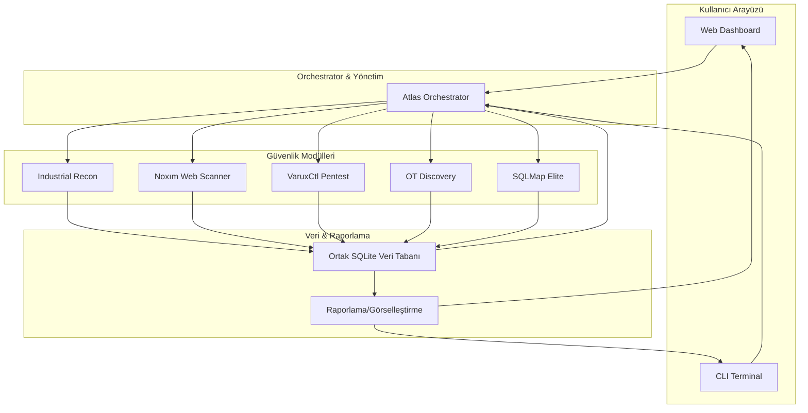

# VARUX Atlas Engine

**Birleşik Endüstriyel Ağ, Web Uygulaması ve Zafiyet Analiz Motoru**

---

## 🧭 Genel Bakış

**VARUX Atlas Engine**, modern endüstriyel ağlar, web uygulamaları ve zafiyetlerin merkezi, otomatik ve akıllı analizini sağlayan modüler bir siber güvenlik platformudur. Saldırı simülasyonu, varlık keşfi, dinamik raporlama ve tam orchestrasyon ile kurumsal seviyede görünürlük ve kontrol sunar.

---

## 🚀 Temel Özellikler

- **Merkezi Orkestrasyon:** Tüm modüllerin ve testlerin tek merkezden yönetimi
- **Endüstriyel Protokol Desteği:** Modbus, S7Comm, DNP3, BACnet, Profinet analizleri ve aktif/pasif keşif
- **Yapay Zeka Destekli Güvenlik:** Web ve ağdaki bilinmeyen zafiyetler için davranışsal analiz
- **Otomatik Sızma Testi:** Keşif ve sömürü akışıyla uçtan uca güvenlik simülasyonu
- **Dinamik Raporlama:** Topoloji, risk puanı, zaman çizelgeli ve canlı görsel raporlar
- **Gelişmiş SQL Zafiyet Analizi:** SQLMap Wrapper ve evasion teknikleriyle modern injection analizi

---

## 🏗️ Mimari Akış Diyagramı



---

## 📦 Kurulum

**Gereksinimler:**  
- Python 3.8+  
- Paketler: `flask`, `dash`, `pandas`, `plotly`, `scapy`, `pymodbus`, `aiosnmp`, `requests`, `colorama` vb.

**Adımlar:**
```bash
git clone https://github.com/username/VARUX-Atlas-Engine.git
cd VARUX-Atlas-Engine
pip install -r requirements.txt
```
Opsiyonel: SQLMap entegrasyonu için sisteminizde sqlmap kurulu olmalı veya proje dizininde bulunmalıdır.

---

## 💻 Kullanım

### Web Dashboard:
```bash
python dashboard.py
```
- Adres: [http://127.0.0.1:8050](http://127.0.0.1:8050)
- Varsayılan giriş:
    - Kullanıcı: `admin`
    - Şifre: `admin123`

### CLI Terminal:
```bash
python atlas.py
```
- Menü üzerinden isteğe bağlı modül seçip test/analiz başlatabilirsiniz.

---

## 🔧 Modüller ve Fonksiyonları

- **Industrial Recon:** Endüstriyel ağda pasif izleme, cihaz/makine tanıma, pcap analizi
- **Noxım Web Scanner:** AI tabanlı web zafiyeti, WAF bypass ve gelişmiş payload analiz
- **VaruxCtl Pentest:** Otomatik saldırı simülasyonu ve uçtan uca pentest döngüsü
- **OT Discovery:** SNMP/LLDP ile OT topolojisi haritalama ve SIEM entegrasyonu
- **SQLMap Elite:** SQL injection analizi, tamper, evasion ve bypass teknikleri

---

## 📸 Ekran Görüntüleri

<table>
  <tr>
    <td></td>
    <td></td>
  </tr>
  <tr>
    <td align="center">Dashboard Panel</td>
    <td align="center">Ağ Topolojisi</td>
  </tr>
</table>

---

## ⚠️ Yasal Uyarı

VARUX Atlas Engine yalnızca yetkili ve eğitim/test ortamlarında kullanılmalıdır. İzinsiz sistemlerde kullanımı suç teşkil eder. Geliştiriciler, kötüye kullanım halinde hukuki sorumluluk kabul etmez. Endüstriyel ortamlarda aktif tarama sistem kesintisine yol açabilir; **daima pasif mod ile başlayınız**.

---

## 📄 Lisans

Bu proje [MIT Lisansı](LICENSE) ile serbestçe kullanılabilir ve dağıtılabilir.

---

<p align="center"><b>Geliştirici: VARUX Security Team ❤️</b></p>
