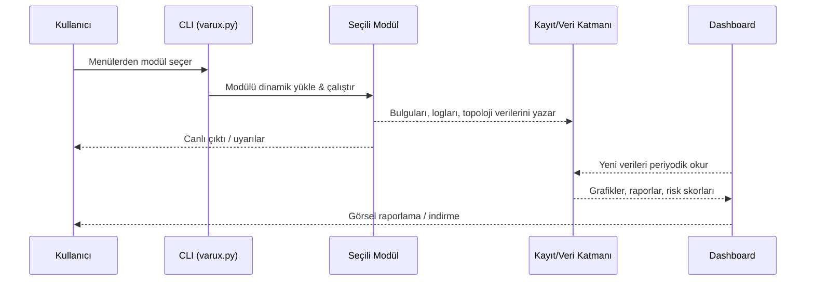

# VARUX Atlas Engine

**Birleşik Endüstriyel Ağ, Web Uygulaması ve Zafiyet Analiz Motoru**

---

## 🧭 Genel Bakış

**VARUX Atlas Engine**, endüstriyel ağlar (ICS/SCADA), web uygulamaları ve veritabanı katmanındaki zafiyetleri tek bir orkestrasyon altında toplayan modüler bir siber güvenlik platformudur. Saldırı simülasyonu, varlık keşfi, dinamik raporlama ve sürekli görünürlük sağlayarak kurumların mavi/kırmızı ekip süreçlerini hızlandırır.

---

## 🚀 Temel Özellikler

- **Merkezi Orkestrasyon:** Tüm modülleri tek menüden çalıştırma, paralel görev kontrolü
- **Endüstriyel Protokol Desteği:** Modbus, S7Comm, DNP3, BACnet, Profinet için pasif/aktif keşif
- **Yapay Zeka Destekli Güvenlik:** Web ve ağ vektörlerinde davranışsal analiz ve öneri üretimi
- **Otomatik Sızma Testi:** Keşif → sömürü → raporlama akışını uçtan uca otomatikleştirme
- **Dinamik Raporlama:** Topoloji, risk puanı, zaman çizelgesi ve gerçek zamanlı görsel raporlar
- **Gelişmiş SQL Zafiyet Analizi:** SQLMap Wrapper ile evasive payload ve tamper otomasyonu

---

## 🏗️ Mimari Diyagramlar

### Genel Akış
```mermaid
flowchart TD
    subgraph UI["Kullanıcı Arayüzü"]
        A1[Web Dashboard (Dash)]
        A2[CLI Terminal (varux.py)]
    end

    subgraph ORC["Orchestrator & Yönetim"]
        B1[Atlas Orchestrator]
        B2[Görev Kuyruğu / Paralel Çalıştırıcı]
    end

    subgraph MOD["Güvenlik Modülleri"]
        M1[Industrial Recon]
        M2[Noxım Web Scanner]
        M3[VaruxCtl Pentest]
        M4[OT Discovery]
        M5[SQLMap Elite Wrapper]
        M6[AI Kod Asistanı]
    end

    subgraph DATA["Veri Katmanı & Raporlama"]
        DB[(SQLite / JSON Kayıtları)]
        RP[Raporlama & Görselleştirme]
        LG[Log / Audit Trail]
    end

    A1 --> B1
    A2 --> B1

    B1 --> B2
    B1 --> MOD

    M1 --> DB
    M2 --> DB
    M3 --> DB
    M4 --> DB
    M5 --> DB
    M6 --> DB

    DB --> RP
    DB --> B1
    RP --> A1
    RP --> A2
    LG --> RP
```

### Modül Veri Akışı


---

## 📦 Kurulum

**Gereksinimler**
- Python 3.8+
- Temel paketler: `flask`, `dash`, `pandas`, `plotly`, `scapy`, `pymodbus`, `aiosnmp`, `requests`, `colorama` vb.

**Adımlar**
```bash
git clone https://github.com/username/VARUX-Atlas-Engine.git
cd VARUX-Atlas-Engine
python -m venv .venv
source .venv/bin/activate  # Windows: .venv\Scripts\activate
pip install -r varux/requirements.txt
```
> Opsiyonel: SQLMap entegrasyonu için sisteminizde `sqlmap` kurulu olmalı veya proje dizininde bulunmalıdır.

---

## 💻 Hızlı Başlangıç

### CLI Orkestratör (Önerilen)
Projeyi kök dizinden çalıştırın:
```bash
python varux.py
```
Menü üzerinden istediğiniz modülü seçip çalıştırabilirsiniz.

#### Doğrudan Komut Satırı ile Otomasyon
Etkileşimli menüye girmeden spesifik modülleri çalıştırabilirsiniz:
```bash
# Tüm modülleri listele
python varux.py --list

# SQLMap Wrapper ile hedef URL taraması
python varux.py --module sqlmap_wrapper --target "http://site.com/vuln.php?id=1"

# AI asistanından yanıt al (isteğe bağlı bağlam dosyası ve notlar)
python varux.py --module ai_assistant --prompt "Modbus ağını sertleştirme adımları" \
  --context ./examples/context.json --notes "Üretim hattı A için"
```
> `--module` parametresi seçildiğinde ilgili modül doğrudan çalışır; eksik
> zorunlu argümanlarda anlamlı uyarılar verilir.

### Web Dashboard
```bash
python dashboard.py
```
- Arayüz: [http://127.0.0.1:8050](http://127.0.0.1:8050)
- Varsayılan giriş:
  - Kullanıcı: `admin`
  - Şifre: `admin123`

### Seçili Modülleri Doğrudan Çalıştırma
```bash
python varux/industrial_recon.py   # ICS/SCADA keşfi
python varux/noxım.py              # Web & SQLi analizi
python varux/varuxctl.py           # Otomatik pentest akışı
python "varux/VARUX OT Discovery Framework.py"  # OT topoloji keşfi
python varux/sqlmap_wrapper.py     # SQLMap Elite Wrapper
```

---

## 🔧 Modüller ve Fonksiyonları

| Modül | Kapsam | Öne Çıkanlar |
| --- | --- | --- |
| **Industrial Recon** | Endüstriyel ağ pasif izleme, pcap analizi | Protokol/parça analizi, cihaz tanıma, uyarı üretimi |
| **Noxım Web Scanner** | Web uygulama zafiyet analizi | AI tabanlı payload önerisi, WAF bypass, davranışsal analiz |
| **VaruxCtl Pentest** | Otomatik saldırı simülasyonu | Keşif → exploit → rapor zinciri, zamanlanmış görevler |
| **OT Discovery** | OT topolojisi haritalama | SNMP/LLDP tabanlı keşif, SIEM entegrasyonu | 
| **SQLMap Elite Wrapper** | SQL injection analizi | Tamper & evasion otomasyonu, log/rapor çıktısı |
| **AI Kod Asistanı** | Kod/görev otomasyonu | OpenAI tabanlı öneri, komut dizisi üretimi |

---

## ⚙️ Konfigürasyon İpuçları
- `.env` veya ortam değişkenleri ile API anahtarlarını ve hassas değerleri saklayın.
- Ağ taramalarında **önce pasif mod** ile başlayıp kısıtlı hedef listesi kullanın.
- Dashboard çıktılarının paylaşımı için `assets/` altına özel logolar veya rapor şablonları ekleyebilirsiniz.

---

## 📸 Ekran Görüntüleri

<table>
  <tr>
    <td></td>
    <td></td>
  </tr>
  <tr>
    <td align="center">Dashboard Panel</td>
    <td align="center">Ağ Topolojisi</td>
  </tr>
</table>

---

## ⚠️ Yasal Uyarı

VARUX Atlas Engine yalnızca yetkili ve eğitim/test ortamlarında kullanılmalıdır. İzinsiz sistemlerde kullanımı suç teşkil eder. Geliştiriciler, kötüye kullanım halinde hukuki sorumluluk kabul etmez. Endüstriyel ortamlarda aktif tarama sistem kesintisine yol açabilir; **daima pasif mod ile başlayınız**.

---

## 📄 Lisans

Bu proje [MIT Lisansı](LICENSE) ile serbestçe kullanılabilir ve dağıtılabilir.

---


test yolo


<p align="center"><b>Geliştirici: VARUX Security Team ❤️</b></p>


